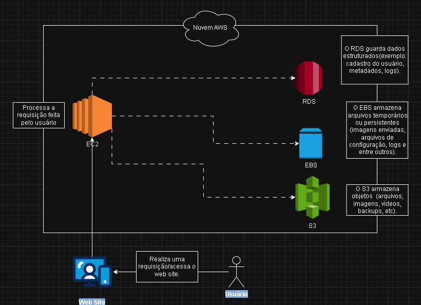
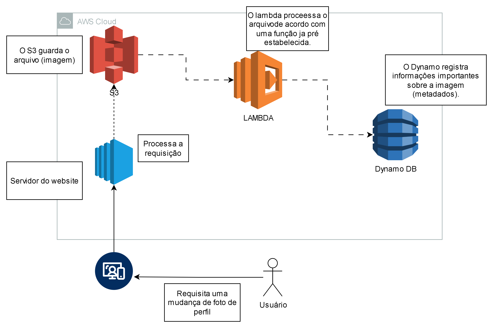

# DesafioCodegirlsAWS-EC2-DIO
Esse repositório tem como objetivo consolidar os meus conhecimentos em gerenciamento de instâncias EC2 na AWS, para o desafio da DIO. Contém as minhas anotações e visões sobre o meu entendimento da matéria, servindo como material de apoio para demonstrar o meu aprendizado na prática.

## Fluxo de requisição de acesso com EC2, EBS, RDS e S3.

 O diagrama abaixo representa uma aplicação web hospedada em uma instância EC2 (Elastic Compute Cloud) do tipo IAAS (infraestutura como serviço), que interage com diferentes serviços de armazenamento e banco de dados da AWS:
 
**EBS (Elastic Block Store)**- Serviço para oferecer armazenamento em blocos, funciona como volumes ou discos rígidos para a instância EC2.

**RDS**(Relational Database service) - Serviço gerenciado de banco de daods relacional, um tipo de "EC2 especializado".

**S3**(Simples Storage Service)- Serviço de armazenamento de objetos, guardar arquivos de forma definitiva e acessa-los de forma simples.(arquivos, imagens, vídeos, etc). 

#### A arquitetura está exemplificada no seguindo diagrama:

 ### Fluxo de dados | Contextualização 
   Se o usuário acessa o web site hospedado no EC2 e faz upload de um aqruivo (foto, vídeo, print, etc), ele será armazenado no S3. Caso o sistema tenha que salvar informações novas ou até iniciais do cadastro desse usuário, isso vai para O RDS. Já o EBS é responsável por armazenar os arquivos temporários e de configurações da instância EC2.

## Fluxo de atualização de perfil de usuário com S3, Lambda e Dynamo DB.
 O diagrama abaixo representa uma aplicação web hospedada em uma instância EC2 que interage com outros serviços da AWS, que são eles: 

 **S3** - Armazenamento de objetos, uma forma de guardar e acessar arquivos de forma simples.
 
 **Lambda** - Um serviço sem servidor da AWS que executa um código em resposta a eventos e a AWS fica responsável por gerenciar as coisas. O utilizador só fornece a função.
 
 **Dynamo DB** - Banco de dados NoSQL serverless.

#### A arquitetura está exemplificada no diagrama a seguir: 

 .

