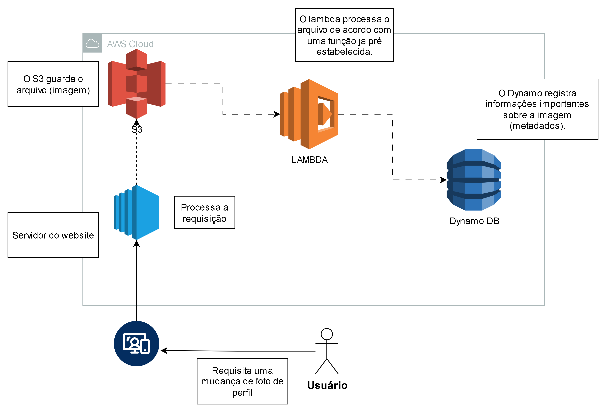
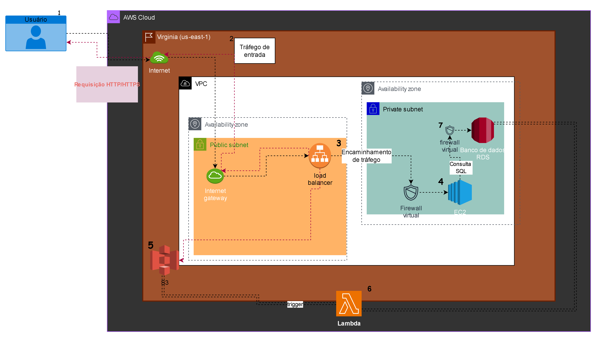

# DesafioCodegirlsAWS-EC2-DIO
Esse repositório tem como objetivo consolidar os meus conhecimentos em gerenciamento de instâncias EC2 na AWS, para o desafio da DIO. Contém as minhas anotações e visões sobre o meu entendimento da matéria, servindo como material de apoio para demonstrar o meu aprendizado na prática.

## ➤ Fluxo de requisição de acesso com EC2, EBS, RDS e S3.

 O diagrama abaixo representa uma aplicação web hospedada em uma **instância EC2** (Elastic Compute Cloud) do tipo IAAS (infraestutura como serviço), que interage com diferentes serviços de armazenamento e banco de dados da AWS:
 
 - **EBS (Elastic Block Store)** - Serviço para oferecer armazenamento em blocos, funciona como volumes ou discos rígidos para a instância EC2.

- **RDS** (Relational Database service) - Serviço gerenciado de banco de daods relacional, um tipo de "EC2 especializado".

- **S3** (Simples Storage Service) - Serviço de armazenamento de objetos, guardar arquivos de forma definitiva e acessa-los de forma simples.(arquivos, imagens, vídeos, etc). 

#### A arquitetura está exemplificada no seguindo diagrama:

 ### Explicação
   Se o usuário acessa o web site hospedado no EC2 e faz upload de um aqruivo (foto, vídeo, print, etc), ele será armazenado no S3. Caso o sistema tenha que salvar informações novas ou até iniciais do cadastro desse usuário, isso vai para o RDS. Já o EBS é responsável por armazenar os arquivos temporários e de configurações da instância EC2.

## ➤ Fluxo de atualização de perfil de usuário com S3, Lambda e Dynamo DB. 
Esse fluxo mostra como funciona a atualização de uma foto de perfil usando serviços da AWS:  

- **S3 (Simple Storage Service)** - É um serviço de **armazenamento de objetos**, usado para guardar e acessar arquivos com mais facilidade. 
- **Lambda AWS** - Serviço de **computação sem servidor (serverless)**. Executa códigos automaticamente em resposta a eventos(triggers), sem precisar gerenciar servidores.  
- **Amazon DynamoDB** → **Banco de dados NoSQL** que é gerenciado pela AWS. Escalável e rápido para salvar e consultar informações.  

#### A arquitetura está exemplificada no diagrama a seguir: 

 .

  ### Contextualização 
 1. O usuário envia uma nova foto de perfil.  
 2. A imagem é salva no **S3**.  
 3. O envio dispara uma função **Lambda**, que processa a imagem (por exemplo: validar e registrar o evento).  
 4. Os detalhes da imagem (metadados, como nome do arquivo e data do upload) são armazenados no **DynamoDB**. 

 ## ➤ Projeto de Arquitetura para E-commerce

Este projeto tem como base um trabalho anterior que realizei, voltado para um **e-commerce** de miniaturas, itens de decoração e ursos de pelúcia. A ideia é adaptar esse projeto para a nuvem utilizando os **serviços da AWS**, aplicando todos os conceitos aprendidos durante os estudos que tive até aqui.

Um e-commerce, naturalmente, precisa lidar com diferentes demandas. Com isso em mente, para gerar uma boa experinência do usuário e a funcionalidade do aplicativo, é fundamental planejar uma arquitetura que suporte variações de tráfego e ofereça estabilidade contra falhas. Assegurando uma boa segurança e a organização.

** ⬡ Segue o exemplo da arquitetura:**
. 

Para que possamos entender o sistema, funciona da seguinte forma:

A solução  foi implementada na region **us-east-1 (Vírginia)** e segue o modelo de 3 camadas(Web, aplicação e Banco de dados).
   1. O Usuário realiza uma requisição pela internet.
   2. O tráfego entra pela **VPC**(Virtual Private Cloud) atráves do **Internet Gateway**.
   3. O **Load Balancer**, localizado numa sub-rede pública distribui as requisições entre múltiplas instâncias **EC2**.
   4. As **instâncias**, em uma sub-rede privada, **processam** a lógica do e-commerce e se conectam ao bando de dados **RDS** para consultar e armazenar informações.
   5. O **S3** está sendo utilizado para **Armazenamento de arquivos** estáticos como imagens de produtos.
   6. O **AWS Lambda** é acionado por triggers(eventos) para executar tarefas automatizadas(Ccódigo).
   7. Os **firewalls virtuais** estão sendo responsáveis pela segurança, garantindo que cada camada tenha acesso apenas ao necessário.

##### *"Tá, Mas quais são os componentes usados?"*
   **⧫ Lista de componentes:**
   
| *Componente* | *Descrição* |
|-----------------|----------------|
| *VPC (Virtual Private Cloud)* | Rede virtual isolada, funciona como seu próprio data center virtual, permitindo que você controle totalmente o ambiente de rede. |
| *Internet Gateway* | Permite a comunicação entre a VPC e a internet pública. |
| *Public Subnet* | Sub-rede que contém recursos com acesso público, como o Load Balancer. |
| *Private Subnet* | Sub-rede onde ficam os recursos internos, como EC2 e RDS, sem acesso direto da internet. |
| *Load Balancer* | Distribui automaticamente o tráfego de aplicações de entrada entre vários destinos e dispositivos virtuais em uma ou mais zonas de disponibilidade  |
| *EC2* | Instâncias de computação que executam a aplicação principal do e-commerce (frontend e backend). |
| *RDS* | Banco de dados gerenciado que armazena informações de usuários, produtos e pedidos. |
| *EBS* | Armazenamento persistente anexado às instâncias EC2, garantindo durabilidade dos dados. |
| *S3* | Armazenamento de objetos utilizado para imagens, backups e outros arquivos estáticos. |
| *Lambda* | Executa funções sob demanda (serverless), em resposta a eventos (triggers) do sistema. |
| *Firewall Virtual* | Controla o tráfego de entrada e saída entre as diferentes camadas da arquitetura. |

### Considerações finais
Entendo a partir desse projeto que ainda há muito o que evoluir, um sistema de e-commerce real é bem mais complexo do que o que eu consegui representar aqui. Mas eu pretendo continuar melhorando e estudando para expandir esse projeto futuramente! :)

**Referências:**
- **Documentação Oficial AWS:**
[Documentação AWS](https://aws.amazon.com/pt/elasticloadbalancing/)
[Documentação sobre instâncias EC2 AWS](https://docs.aws.amazon.com/pt_br/toolkit-for-visual-studio/latest/user-guide/tkv-ec2-ami.html)

